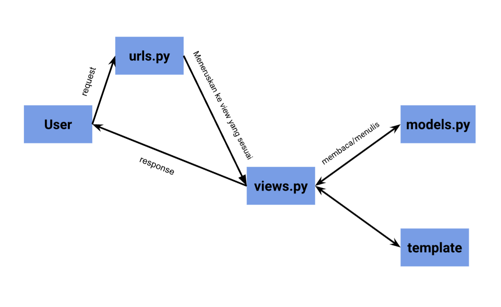

# MamPedia

Sebuah proyek Django sederhana Tugas Mata Kuliah Pemrograman Berbasis Platform oleh Imam Fajri 2306165566.

## Tugas 2

### Proses Pembuatan Projek Django
1. Membuat sebuah _repository_ Github baru bernama ```mampedia```
2. Meng-_clone repostiory_ kosong tersebut ke komputer
3. Di direktori asal Membuat _virtual environment_ Python baru dengan command:

    ```bash
    python -m venv env
    ```
4. Menyalakan _virtual environment_ Python baru dengan command:
    ```bash
    source env/bin/activate
    ```
5. Mempersiapkan _requirements_ dengan _neovim_
    ```bash
    nvim requirements.txt
    ```
    isi dari requirements.txt
    ```
    django
    gunicorn
    whitenoise
    psycopg2-binary
    requests
    urllib3
    ```
6. Meng-_install requirements_ dengan pip
    ```bash
    Python -m pip install -r requirements.txt
    ```
7. Membuat proyek Django baru dengan command:
    ```bash
    django-admin startproject mampedia .
    ```
8. Mengubah ```ALLOWED_HOSTS``` di file ```settings.py``` dengan menambahkan ```"*"``` agar proyek ini bisa dijalankan di host/domain apapun.

9. Membuat aplikasi ```main``` dengan command:
    ```bash
    python manage.py startapp main
    ```
10. Menambahkan nama aplikasi ke ```INSTALLED_APPS``` pada file ```settings.py``` di direktori ```mampedia```

11. Me-_routing_ url pada file ```urls.py``` di direktori ```mampedia``` sehingga isi file ```urls.py``` menjadi:
    ```python
    from django.contrib import admin
    from django.urls import path, include

    urlpatterns = [
        path('admin/', admin.site.urls),
        path('', include('main.urls')),
    ]
    ```
12. Mengubah ```models.py``` menjadi:
    ```python
    from django.db import models

    class Atribut(models.Model):
        name = models.CharField(max_length=255)
        price = models.IntegerField
        description = models.TextField
        quantity = models.IntegerField
    ```
13. Melakukan migrasi dengan command:
    ```
    python manage.py makemigrations
    python manage.py migrate
    ```
14. Membuat direktori template dan template ```html``` untuk laman ```main```:

    ```html
    <h1>MamPedia Semua Ada</h1>
    <h4>NPM: 2306165566</h4>
    <h4>Name: Imam Fajri</h5>
    <h4>Class: PBP C</h4>
    <h5>Nama Pesanan</h5>
    <p>{{ name }}<p>
    <h6>Harga</h6>
    <p>{{ price }}<p>
    <h5>Jumlah Pesanan</h5>
    <p>{{ quantity }}<p>
    <h6>Deksripsi</h6>
    <p>{{ description }}<p>
    ```
15. Menambahkan fungsi untuk me-_render_ laman main pada file ```views.py```:
    ```python
    from django.shortcuts import render

    def show_main(request):
    context = {
        'name' : 'Sate Pacil',
        'price': 'Rp.15.000',
        'quantity': '1',
        'description': 'Sate adalah makanan ayam yang sangat enak',
    }

        return render(request, "main.html", context)
    ```

16. Melakukan routing pada aplikasi ```main``` pada file ```urls.py``` di direktori main:
    ```python
    from django.urls import path
    from main.views import show_main

    app_name = 'main'

    urlpatterns = [
        path('', show_main, name='show_main'),
    ]
    ```

17. Mengetest aplikasi pada localhost dengan command:
    ```
    python manage.py runserver
    ```
    kemudian membuka ```http://localhost:8000/``` di _browser_

18. Melakukan deploy app ke situs _Adaptable_

**Bagan Arsitektur Django**

Terlihat bahwa _request_  dari user akan diproses terlebih dahulu sehingga dapat diteruskan ke View yang sesuai. kemudian View tersebut akan membaca/menulis data di Model dan menggunakan Template untuk menampilkan dan mengembalikan _response_ ke _user_

**Fungsi git dalam pengembangan perangkat lunak**
